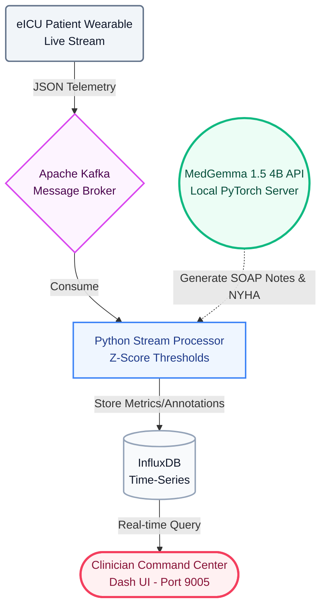

<h1 align="center">🩺 HeartGuard AI</h1>
<h3 align="center">Wearable-Integrated Remote AI Copilot for In-Home Heart Failure Monitoring</h3>

<p align="center">
  
  
  
  
</p>

---

## 🌟 About the Project

**HeartGuard AI** is a real-time Remote Patient Monitoring (RPM) command center natively powered by Google's **MedGemma 1.5 4B Instruction-Tuned** model. It is designed specifically for the prestigious *Kaggle MedGemma Impact Challenge*.

The system establishes a continuous pipeline from a patient's in-home wearable device straight to the remote clinician's screen. It beautifully overlays powerful generative AI reasoning on top of deterministic mathematical algorithms to instantly auto-generate **NYHA Classifications** and **Clinical SOAP Notes** the exact second a patient's health trajectory deteriorates.

### 🚀 Key Features
- **Real-time Telemetry:** Simulates medical wearable IoT streams (HR, SpO2, RR) effortlessly via Apache Kafka.
- **Deterministic Risk Bounding:** Computes instantaneous Z-score health thresholds natively via InfluxDB to absolutely eliminate raw AI hallucinations.
- **MedGemma 1.5 Engine:** Uses a localized PyTorch `bfloat16` Hugging Face Python Server to infer hyper-accurate medical reasoning, ensuring 100% HIPAA data privacy (Zero External APIs).
- **Clinician Command Center:** Features a stunning "Premium Glassmorphism" UI built entirely from scratch utilizing Python Dash & Plotly.

---

## 🏗️ System Architecture

Our 100% On-Premise telemetry pipeline forces the AI into a pure "translational" bounding box, strictly isolating MedGemma's generative logic from our deterministic mathematical baseline scoring:



---

## 💻 Installation & Setup

Want to run HeartGuard AI natively on your own GPU? Follow this simple, beginner-friendly guide!

### 📋 Prerequisites
- **OS:** Linux (Ubuntu/Debian recommended) or Windows WSL2
- **Hardware:** An NVIDIA GPU with at least **8GB VRAM** (RTX 3070, 4070, A10g, etc.)
- **Software:** Docker, Docker Compose, and Python 3.12
- **Authentication:** You MUST possess a Hugging Face Account, [Sign the Google MedGemma 1.5 License](https://huggingface.co/google/medgemma-1.5-4b-it), and generate an Access Token.

### ⚙️ Step-by-Step Guide

**1. Clone the Repository**
```bash
git clone https://github.com/EmrullahAydogan/heartguard-ai.git
cd heartguard-ai
```

**2. Configure Environment Secrets**
Open the `.env` file in the root directory and securely paste your Hugging Face Token:
```env
HF_TOKEN=hf_your_hugging_face_token_here
MEDGEMMA_MODEL=google/medgemma-1.5-4b-it
```

**3. Boot Up the Artificial Intelligence Server**
HeartGuard AI utilizes a completely localized Python HTTP server to host and infer the MedGemma model without ever pushing patient data into the cloud. 
Launch it directly on your GPU:
```bash
# Enter the processor directory
cd processor

# Install the strict HuggingFace dependencies
pip install -r requirements.txt

# Start the server (Listens on Port 8888)
# *Note: The very first launch will automatically pull ~8GB of Model Weights!*
python3 medgemma_server.py
```

**4. Launch the Docker Infrastructure**
Once your terminal proudly says `Model loaded successfully!`, open an entirely **new terminal window** in the project root directory (`heartguard-ai/`) and spin up the Kafka streams, InfluxDB buffer, and the Clinician Dashboard using Docker Compose:
```bash
docker compose up -d --build
```

---

## 🩺 Usage: Accessing The Clinician Dashboard

Once all containers show as healthy, your AI Command Center is strictly live:

👉 **Open your web browser and navigate to: [http://localhost:9005](http://localhost:9005)**

From this gorgeous "Dark Glassmorphism" interface, you can effortlessly:
- Monitor live vital sign waveforms and dynamic health scores for active simulated patients.
- Read real-time **SOAP Notes** instantly formulated by MedGemma 1.5 during any clinical warnings.
- Interact with the **Optimistic-UI Chatbot** to effortlessly ask MedGemma highly detailed clinical questions referencing a patient's historical stream.

---

## 🛠 Troubleshooting
- **Model stuck downloading forever?** It's drawing an 8GB `.safetensors` file. Bandwidth matters!
- **Error 403 Forbidden File?** You bypassed clicking **"Agree & Access"** on the restrictive [MedGemma Hugging Face page](https://huggingface.co/google/medgemma-1.5-4b-it). Do that first!
- **CUDA Out of Memory (OOM)?** Ensure you genuinely have at least 8 Gigabytes of pure, unallocated GPU VRAM open. Close external browsers or VRAM hogs.

---

<p align="center">
  <i>Developed masterfully by <b>Emrullah Aydogan</b> for the <b>Kaggle MedGemma Impact Challenge</b>.</i><br>
  Open sourced under the MIT / CC BY 4.0 License.
</p>
